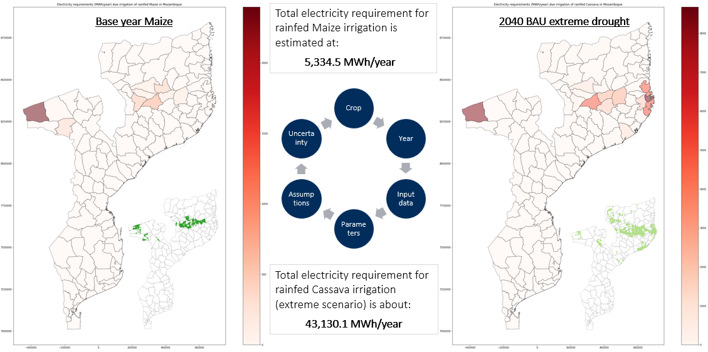

## Agriculture based energy demand

### Overview

Achieving universal electricity access by 2030 requires a rapid increase in the rate of new connections and in levels of investment, particularly in countries with low levels of access to electricity. Residential demand has been the main focus in many of the existing geospatial electrification models to date, with the role of productive uses only marginally included.

However, access to electricity is a key part of improving rural productivity and income generating opportunities and therefore a crucial part of many African countries' economic development plans over the coming decade. Electrification of agriculture-related activities for example can create new opportunities in rural areas and lead to a socio-economic uplift. In turn, income generating activities can help diversify the potential customer pool, enhance business models and increase viability of electrification projects.

This section briefly presents an analytical and spatially explicit approach for estimating aspects of electricity requirements related to agricultural activities; namely irrigation and few selected post-harvest activities. The underlying work has been a collaborative effort between [Vivid Economics](https://www.vivideconomics.com/) and [KTH Royal Institute of Technology](https://www.energy.kth.se/energy-systems/about-the-division-of-energy-systems-1.937036) and is part of a multi-year ESMAP-funded project - Geospatial Electrification Planning in the Africa Region (P165617) - aiming to facilitate the execution of geospatial electrification planning activities in various sub-Saharan African countries.

### Methodology

.")

The core part of the methodology is the **irrigation model**, which was developed to provide an estimate of crops’ water and electricity requirements in a designated area of interest (AoI). The ‘agrodem’ model has been constructed as such to allow for its full customization by the user based on available data, information and other modelling constraints.

**Downscaling methods** have been explored in order to overcome data limitations or low resolution crop allocation data. The supporting methodology can help users build up input data in higher resolution using existing tabular data from surveys or statistics.

To evaluate **future scenarios**, relevant code was developed in order to enable users explore hypothetical alternative scenarios of cropland expansion (“extensification”). This component enables the user to evaluate the impact of expected changes to crops, as well the impact that policy can have on the expansion of crops to new areas over time. Users can interact with the code and create alternative future scenarios that best suit the purpose of the modelling exercise.

Finally, the model has been augmented to allow for assessment of electricity requirements for **post-harvest activities** (milling, drying, pressing, cold storage etc.). The model was developed as such to allow calibration of input data depending on the type of crop and AoI.

----

#### Note

Each block of work described above is characterized by three elements, namely input – process – output. It also comes with open source code (available in the form of jupyter notebooks) that provides a clear step-by-step description of how to run the embedded processes. Full access to the code behind the model is available on [GitHub](https://github.com/akorkovelos/agrodem). Additional documentation is [available here](https://agrodem.readthedocs.io/en/latest/index.html).

----

### Output

The primary output of the model indicates electricity requirements for irrigation of the selected crop and AoI. The spatial resolution of the results are defined by the initial vector later and stored in any GIS compatible, OGC complaint format (e.g .shp, .csv, .gpkg, .tiff). Each row indicates a particular location (e.g. farm); and each column indicates a particular attribute for this location. These include all attributes used to derive electricity requirements in the first place and products of the analysis (water and electricity requirements).

 in Mozambique. Source: KTH, Vivid Economics.")

Of course, the degree of employment of the modelling blocks described earlier allow for different levels of analysis. They can be used to develop more complex scenarios and assess the model’s sensitivity to different input parameters (e.g., type of crops, crop calendar and yearly cycles, water management techniques, future scenarios, climate sensitivity, inclusion of post-harvesting activities) to name a few.

### Integration to geospatial least-cost modelling

As described earlier, the modelling output consists of GIS layers indicating electricity demand for agricultural processing of a crop (or a combination of them), including e.g. irrigation and post-harvesting activities at a national level and under a defined scenario. This layer can be integrated with geospatial electrification modelling frameworks (e.g., the GEP) as follows:

- A first-order integration may include the simple overlay of modelling outputs for a quick visual inspection and a high-level overview of key areas of interest (or hotspots) of electrification. 
- A second-order integration may include the utilization of the agrodem output layer(s) into the modelling process. The model will then aggregate agricultural and residential electricity demand and assess the least cost electrification option. For example the GEP-OnSSET model has been developed in a way that allows such an integration. The model can then generate scenarios that explore the electrification mix with/without the inclusion of agricultural demand or even focus only on the agriculture nodes and assess their least cost electrification options.

 due to irrigation needs in Mozambique. Indicative example using agrodem results in GEP-OnSSET. Source: The World Bank.")

### Contact

For any questions, feedback or general inquiries please do not hesitate to contact the development team:

- [Rhonda Lenai Jordan](mailto:rjordan@worldbank.org) 
- [Alexandros Korkovelos](mailto:akorkovelos@worldbank.org)
- [Bonsuk Koo](mailto:bkoo@worldbank.org)
- [Kabir Malik](mailto:kmalik@worldbank.org)
