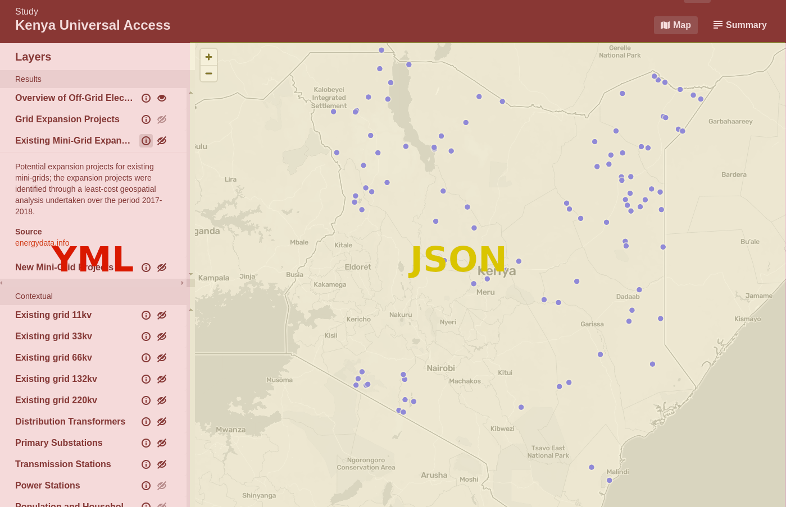

# Configuring studies

* [Basic anatomy of a study](#basic-anatomy-of-a-study)
* [Study configuration](#study-configuration)
* [Map configuration](#map-configuration)
* [Validating configuration](#validating-configuration)
* [Custom markers](#custom-markers)
* [FAQ](#faq)
* [Troubleshooting](#troubleshooting)

## Basic anatomy of a study
The study configuration consists of two files:

* a `yml` file that contains the basic information and metadata of the study.
* a `json` file that contains the map configuration.



## Validating configuration
The `yml` and `json` files in `/content/study` are automatically validated when pushing a change to Github. If validation fails, it won't be possible to merge these changes into the `main` branch.

Validation is done in two steps:

1. the `yml` files are validated using the study schema in [`/schema/validate.js`](/schema/validate.js)
2. the `json` files are validated using the [Mapbox Style Specification](https://docs.mapbox.com/mapbox-gl-js/style-spec/)

### Validating locally
To validate changes prior to pushing them to Github, you can run the following command:

```
yarn validate
```

## Custom markers
AEP supports a number of custom icons that can be used to style point data instead of colored circles. See the folder `/content/icons` for the icons that are currently supported.

### Add icon to a layer
Define a [`symbol`](https://docs.mapbox.com/mapbox-gl-js/style-spec/layers/#symbol) layer. The name of the `icon-image` is the basename of the file, without extension `.png`.

For example:

``` json
{
  "id": "transformers",
  "type": "symbol",
  "source": "transformers",
  "source-layer": "data_layer",
  "layout": {
    "icon-image": "electricity"
  }
}
```

### Add new icons to AEP
New icons can be added to [`/content/icons`](/content/icons). They should be in `.png` format and measure 64 x 64px.


## FAQ

## Troubleshooting

### Map shows an unexpected layer
If the map loads with a layer that can't be managed through the layer switcher, it's likely that you added a layer in the Mapbox Style that isn't referenced in the layer configuration of the `yml`. This is by design. It allows you to overlay a contextual layer on the map that the user don't have control over. A use case could be a layer that adds a disputed border.
