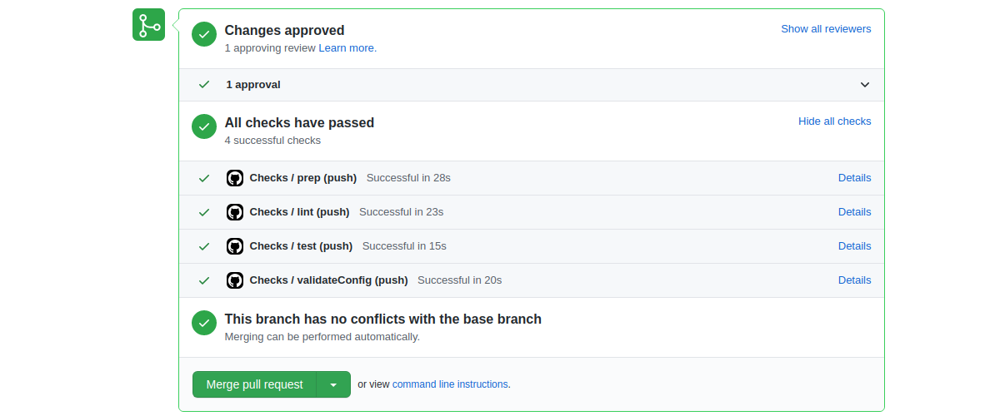
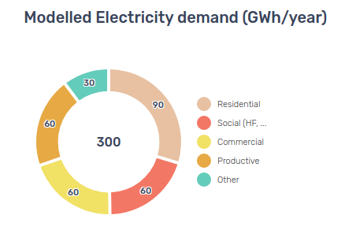
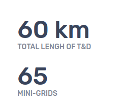
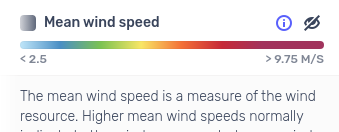
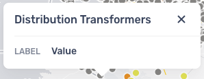

# Anatomy of a study
The study configuration consists of two files:

* a `yml` file that contains the basic information and metadata of the study.
* a `json` file that contains the map configuration.


## Study configuration
The main information and metadata of each study is managed through a `yml` file, with the following structure. For a full example, please see [`kenya.yml`](/content/study/posts/kenya.yml)

| key | format | description |
| --- | --- | --- |
| title | `string` | The title of the study |
| bbox | [`LngLatBounds`](https://docs.mapbox.com/mapbox-gl-js/api/geography/#lnglatbounds) object | The initial bounds of the map |
| zoomExtent | `array` of `numbers` | The minimum and maximum zoom of the map |
| mapConfig | `string` | The filename that contains the study's map configuration |
| country | `string` | Country name |
| study | `object` | Metadata about the study |
| study.consultant | `string` | Name of the consultant |
| study.period | `string` | Period of the study |
| study.scope | `string` | Brief decription of the scope of the study |
| study.summary | `string` | Summary of the study results |
| platform | `object` | Reference to an external platform that hosts full study results |
| platform.title | `string` | Title of the platform |
| platform.url | `string` | URL of the platform |
| layers | `array` | The layers that make up the layer switcher |
| layers[].id | `string` | Unique ID of the layer |
| layers[].name | `string` | Name of the layer that appears in the layer switcher |
| layers[].category | `enum` one of [`contextual`, `results`] | The layer category is used to organize the layers |
| layers[].mbLayer | `string` | ID of the layer. Should refer to a layer in the map configuration |
| layers[].info | `string` | Used for the description in the info drawer |
| layers[].disabled | `boolean` | If set to true, the `enable/disable` icon will be disabled. *Optional, defaults to false* |
| layers[].visible | `boolean` | If set to true, this layers is enabled on first load. *Optional, defaults to false* |
| layers[].info | `string` | Used for the description in the info drawer |
| layers[].source | `object` | Link to the data source |
| layers[].source.name | `string` | Name of the source link |
| layers[].source.url | `string` | URL of the data source |
| layers[].legendData | `object` | Custom legend |
| layers[].legendData.type | `enum` one of [`gradient`, `line`, `circle`, `symbol`] | Type of legend |
| layers[].legendData.color | `string` | The color of the feature. Applies to `circle` and `line` |
| layers[].legendData.dashed | `boolean` | Use a dashed line. Applies to `line` |
| layers[].legendData.icon | `string` | The basename of the icon, without file extension. Applies to `symbol` |
| layers[].legendData.min | `string` | Minimum value printed on the x-axis. Applies to `gradient` |
| layers[].legendData.max | `string` | Maximum value printed on the x-axis. Applies to `gradient` |
| layers[].legendData.stops | `array` | An array with RGB colors that indicate the stops. Applies to `gradient` |
| layers[].displayData | `array` | Configuration for the data to be displayed on the popover |
| layers[].displayData[].label | `string` | A static label for the popover. Exclusive with `labelProp` |
| layers[].displayData[].value | `string` | A static value for the popover. Exclusive with `valueProp` |
| layers[].displayData[].labelProp | `string` | A dynamic label for the popover. Exclusive with `label` |
| layers[].displayData[].valueProp | `string` | A dynamic value for the popover. Exclusive with `value` |

## Map configuration
The map of each study is configured using a `json` file that follows the Mapbox Style specification. For a full example, please see [`kenya-mb.json`](/content/study/posts/kenya-mb.json).

Leveraging the MB Style Specification provides a high degree of control over the style and interaction of the map of each study. Please refer to the [Mapbox documentation](https://docs.mapbox.com/mapbox-gl-js/style-spec/) for a full description of the style spec.

In addition to the default Mapbox styling, AEP has its own set of default styles, optimized for country level analysis. For more details see the [AEP default style](#aep-default-style) section.

## Validating configuration
The `yml` and `json` files in `/content/study` are automatically validated when pushing a change to Github. If validation fails, it won't be possible to merge these changes into the `main` branch.

Validation is done in two steps:

1. the `yml` files are validated using the study schema in [`/schema/validate.js`](/schema/validate.js)
2. the `json` files are validated using the [Mapbox Style Specification](https://docs.mapbox.com/mapbox-gl-js/style-spec/)


*All checks passing*

### Validating locally
To validate changes prior to pushing them to Github, you can run the following command:

```
yarn validate
```

[To top](#managing-studies)

# Howto
## Add a new study

1. create a new Github branch from `main`
2. add a `yml` file to `/content/study/posts` with the [study configuration](#study-configuration). The filename is used to determine the URL of the study. (`kenya.yml` -> `/studies/kenya`)
3. add a `json` file to `/content/study/posts` with the [map configuration](#map-configuration)
4. set up a Pull Request and merge once [the validations](#validating-configuration) are run successfully

## Add a layer
To add a new layer to a study that users can interact with, requires three things:

1. add a source to the Mapbox Style Specification that references the dataset. This example shows a GeoJSON, but other types like raster or vector tiles are also supported.  
``` json
"minigrid-proposed": {
  "data": "https://aep-tiles.staging.derilinx.com/geojson/ke/proposed_kosap_minigrid-wgs84.json",
  "type": "geojson"
}
```
2. add a layer to the Mapbox Style Specification that references the source.  
```json
{
  "id": "minigrid-proposed",
  "type": "circle",
  "source": "minigrid-proposed"
}
```
3. add a layer to the study configuration (`yml`). This configures the layer in the layer switcher.  
```yml
  - id: minigrid-new
    name: New Mini-Grid Projects
    category: result
    mbLayer: minigrid-proposed
    info: Potential mini-grid projects; these projects were identified through a least-cost geospatial analysis undertaken over the period 2017-2018.
    source:
      name: energydata.info
      url: https://energydata.info/dataset/kenya-potential-new-mini-grid-sites
```

## Adjust the style of a layer
The style of each map layer can be customized in the `json` file with map configuration. The following example makes all the lines in this dataset yellow.

```json
{
  "id": "kv",
  "type": "line",
  "source": "11kv",
  "paint": {
    "line-color": "#FFC700"
  }
}
```

It's possible to apply advanced custom styling to each layer. For a full overview, see the [Mapbox documentation](https://docs.mapbox.com/mapbox-gl-js/style-spec/layers/).

## Change the order of layers on the map
The order of the layers on the map is determined by the order of the `layers` array in the [map configuration](#map-configuration). The first layer in this array is the bottom-most layer on the map, the last layer the top-most.

[To top](#managing-studies)

# Map style
## AEP default style
*More information to come*

## Custom markers
AEP supports a number of custom icons that can be used to style point data instead of colored circles. See the folder `/content/icons` for the icons that are currently supported.

### Add icon to a layer
Define a [`symbol`](https://docs.mapbox.com/mapbox-gl-js/style-spec/layers/#symbol) layer. The name of the `icon-image` is the basename of the file, without extension `.png`.

For example:

``` json
{
  "id": "transformers",
  "type": "symbol",
  "source": "transformers",
  "source-layer": "data_layer",
  "layout": {
    "icon-image": "electricity"
  }
}
```

### Add new icons to AEP
New icons can be added to [`/content/icons`](/content/icons). They should be in `png` format and measure 64 x 64px.

[To top](#managing-studies)

# Charts
The charts on the Summary page are configured and managed through the `yml` file with study configuration. They are included on the right side of the summary page and ordered using the order in the study configuration file.

## Donut
The donut has a chart title (`name`) and a data array that consists of entries with a `name` and `value`.



Configuration:

```yml
charts:
  - name: Modelled Electricity demand (GWh/year)
    type: donut
    data:
      - name: Residential
        value: 90
      - name: Social (HF, EF, public)
        value: 60
      - name: Commercial
        value: 60
      - name: Productive
        value: 60
      - name: Other
        value: 30
```

## Big number
The big number consists of a title (`name`), a `value` and an optional `unit`.


_Big number with and without the `unit`_

Configuration:

```yml
charts:
  - name: Total lengh of T&D
    type: number
    datum:
      value: 60
      unit: km
```

[To top](#managing-studies)

# Legends
Broadly speaking, AEP supports two types of legends: symbology for features on the map like circles and lines and gradient legends for raster data like the Global Wind Atlas.

## Customizing vector legends
The platform will automatically determine the legend for vector layers. It's possible to override these defaults by specifying a `legendData` object on the layer configuration. For example:

### Line


``` yml
legendData:
  type: line
  color: '#00FF00'
  dashed: true
```

### Symbol


``` yml
legendData:
  type: symbol
  icon: 'electricity'
```

## Defining raster legends
The legend for external data layers can't be automatically determined by AEP and always have to be defined through configuration. The platform currently supports linear gradients, below is an example with 7 color stops.




``` yml
legendData:
  type: gradient
  min: '< 2.5'
  max: '> 9.75 m/s'
  stops:
    - '#BEE6FA'
    - '#488FC6'
    - '#7BC34C'
    - '#F9E65B'
    - '#F56E2B'
    - '#C82333'
    - '#A3305C'
```

[To top](#managing-studies)

# Popups
By default, the popups in the application show all the attributes that are available in the source data. This can be customized by specifying a `displayData` list on the layer configuration.


## Customizing popup data
It is possible to extract data from the features the map layer and display it on a popover.
For each layer you can specify a `label:value` pair using a syntax expression.


_The label property will always be displayed in uppercase format._

There are 2 properties to get a label and a value.
  - When using `label` the value is assumed static and will be displayed as is.
  - When using `labelProp` the value will be extracted from the feature data and computed.

These two properties are mutually exclusive. Use one or the other, not both at the same time. The same is true for `value` and `valueProp`.

To allow some processing of labels and values it is possible to use a simple inline piping syntax to define functions (and respective arguments) to apply to a value.
The feature property name is always the first element to appear and subsequent functions are separated using pipes `|` and arguments are separated using colons `:`

Example:
```
road_length|round:2|suffix:km
```
In this example the system would get the value of the property `road_length` from the selected feature, `round` it to `2` decimal digits, and then add a `suffix` of `km`.

The available functions are:
```
sum : value
subtract : value
multiply : value
divide : value
prefix : value
suffix : value
capitalize
toUpperCase
toLowerCase
round : decimal_digits
```

# Troubleshooting
## Map shows an unexpected layer
If the map loads with a layer that can't be managed through the layer switcher, it's likely that you added a layer in the Mapbox Style that isn't referenced in the layer configuration of the `yml`. This is by design. It allows you to overlay a contextual layer on the map that the user don't have control over. A use case could be a layer that adds a disputed border.
